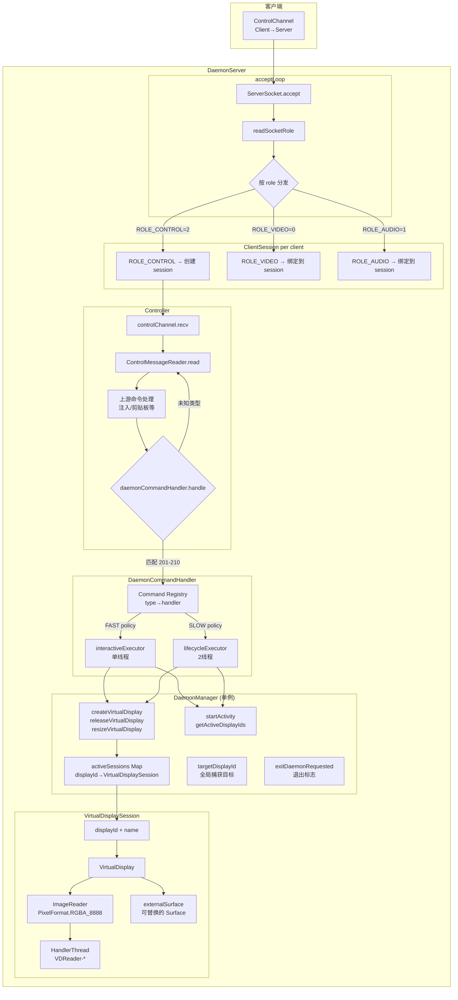
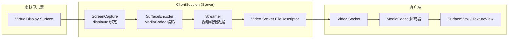
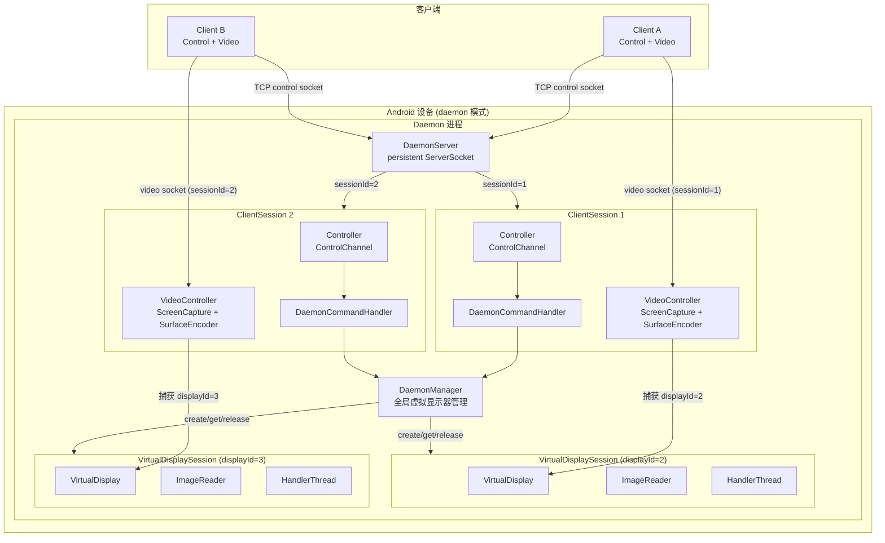

# Daemon Control Protocol API

基于 scrcpy ControlChannel 的二进制协议，在 daemon 模式下管理虚拟显示器生命周期、Activity 启动、输入事件注入、视频流控制等功能。

## 连接架构

Daemon 模式采用多客户端 TCP 服务器架构，支持多个客户端同时连接并独立操作。

### Socket 角色

每个客户端需要建立最多 3 个 TCP Socket，通过首字节区分角色：

| Role 值 | 常量               | 用途                     | 必需 |
| ------- | ------------------ | ------------------------ | ---- |
| 0       | `ROLE_VIDEO`       | 传输视频编码流           | 否（按需） |
| 1       | `ROLE_AUDIO`       | 传输音频编码流           | 否   |
| 2       | `ROLE_CONTROL`     | 传输控制命令和设备响应   | 是   |

### 连接流程

```
客户端                              DaemonServer
  │                                     │
  │──── TCP connect ──────────────────→ │
  │←─── ServerSocket.accept() ───────── │
  │                                     │
  │─── write ROLE_CONTROL (2) ────────→ │
  │                                     │ readSocketRole()
  │←─── writeSessionId (4 bytes BE) ─── │  ← 服务端分配唯一 sessionId
  │←─── writeDeviceMeta (64 bytes) ──── │  ← 设备名称，UTF-8 填充至 64 字节
  │                                     │
  │        (可选: video/audio socket)    │
  │─── write ROLE_VIDEO (0) ──────────→ │  → readSessionId → 绑定到对应 ClientSession
  │─── write ROLE_AUDIO (1) ──────────→ │  → readSessionId → 绑定到对应 ClientSession
```

### Session 管理

- 每个 `ROLE_CONTROL` Socket 对应一个唯一的 `ClientSession`（sessionId 从 1 开始单调递增）
- 同一 session 的 video/audio Socket 通过 4 字节 sessionId 绑定
- 最多支持 16 个并发 session（`MAX_SESSIONS = 16`）
- 所有 session 共享全局的 `DaemonManager` 虚拟显示器管理

### 端口配置

通过命令行参数配置（与 scrcpy 原生参数一致，均采用 `key=value` 形式）：

| 参数                  | 默认值    | 说明                       |
| --------------------- | --------- | -------------------------- |
| `daemon`              | false     | 是否以 daemon 模式运行     |
| `daemon_port`         | 27183     | TCP 监听端口               |
| `daemon_bind_address` | 127.0.0.1 | 绑定地址                   |

启动示例：

```
app_process / com.genymobile.scrcpy.Server 4.1 \
    tunnel_forward=true audio=false send_frame_meta=true cleanup=false \
    daemon=true daemon_port=27183 daemon_bind_address=127.0.0.1
```

## 传输协议

所有命令和响应均通过 scrcpy 的 **ControlChannel** 传输，底层为 TCP Socket 的双向数据流。

### 消息类型范围

| 分类                  | 范围       | 用途                               |
| --------------------- | ---------- | ---------------------------------- |
| 上游控制命令          | 0 - 22     | scrcpy 原生控制（按键、触摸等）    |
| **Daemon 控制命令**   | **201 - 210** | **虚拟显示器、视频流与 daemon 管理命令** |
| 上游设备响应          | 0 - 2      | scrcpy 原生响应（剪贴板、UHID等）  |
| **Daemon 设备响应**   | **100 - 101** | **Daemon 命令的响应消息**          |

### 消息帧通用格式

```
    byte 0            byte 1-8           byte 9...
    ┌──────────────┬─────────────────┬──────────────────────┐
    │ message_type │   sequence (8B)  │      payload ...      │
    │   (1 byte)   │   big-endian     │   (varies by type)    │
    └──────────────┴─────────────────┴──────────────────────┘
```

## Control Commands (客户端 → Server)

| ID   | 名称                              | 文档                                           |
| ---- | --------------------------------- | ---------------------------------------------- |
| 201  | Create Virtual Display            | [create-virtual-display.md](create-virtual-display.md) |
| 202  | Release Virtual Display           | [release-virtual-display.md](release-virtual-display.md) |
| 203  | Resize Virtual Display            | [resize-virtual-display.md](resize-virtual-display.md) |
| 204  | Start Activity                    | [start-activity.md](start-activity.md) |
| 205  | Get Active Display IDs            | [get-active-display-ids.md](get-active-display-ids.md) |
| 206  | Inject Input Event With Display ID| [inject-input-event-with-display-id.md](inject-input-event-with-display-id.md) |
| 207  | Switch Display                    | [switch-display.md](switch-display.md) |
| 208  | Exit Daemon                       | [exit-daemon.md](exit-daemon.md) |
| 209  | Start Video Stream                | [start-video-stream.md](start-video-stream.md) |
| 210  | Stop Video Stream                 | [stop-video-stream.md](stop-video-stream.md) |

### 命令执行策略

DaemonCommandHandler 内部使用两个线程池：

| 策略    | 线程池              | 命令类型                              |
| ------- | ------------------- | ------------------------------------- |
| `FAST`  | `interactiveExecutor` (单线程) | Get Active IDs, Inject Event, Switch Display, Exit Daemon |
| `SLOW`  | `lifecycleExecutor` (2线程)    | Create/Release/Resize Display, Start Activity, Start/Stop Video Stream |

## Device Responses (Server → 客户端)

### TYPE: 100 - Generic Response

通用响应格式，大多数 daemon 命令使用此类型回复。

| Field        | Type    | Size   | Description                                          |
| ------------ | ------- | ------ | ---------------------------------------------------- |
| type         | uint8   | 1 byte | 响应类型，固定值 `100`                               |
| sequence     | int64   | 8 bytes| 对应请求的序列号                                     |
| status_code  | int32   | 4 bytes| `0` 成功，`-1` 失败                                  |
| display_id   | int32   | 4 bytes| 相关的显示器 ID（无关联时为 `-1`）                   |
| msg_length   | int32   | 4 bytes| 响应描述的 UTF-8 字节长度                            |
| msg          | string  | N bytes| 响应描述（UTF-8 编码）                               |

### TYPE: 101 - Active Displays Response

仅用于 Get Active Display IDs 命令的响应。

| Field          | Type      | Size      | Description                                          |
| -------------- | --------- | --------- | ---------------------------------------------------- |
| type           | uint8     | 1 byte    | 响应类型，固定值 `101`                               |
| sequence       | int64     | 8 bytes   | 对应请求的序列号                                     |
| count          | int32     | 4 bytes   | 活跃显示器数量                                       |
| display_ids[]  | int32[]   | N×4 bytes | 活跃显示器 ID 数组                                   |

## 序列号机制

每个请求消息必须携带一个唯一的 `sequence`（int64），server 会在对应的响应中原样返回。客户端通过序列号匹配请求与响应。

建议使用单调递增的 `AtomicLong` 生成序列号（从 1 开始，0 保留为无效值）。

## 典型工作流

### 虚拟显示器创建与使用流程

```
客户端-1                            DaemonServer
  │                                    │
  │─── ROLE_CONTROL Socket ──────────→ │
  │←─── sessionId=1 ───────────────── │
  │                                    │
  │─── TYPE 201 创建虚拟显示 ─────────→ │
  │                                    │ DaemonManager.createVirtualDisplay()
  │                                    │   → VirtualDisplaySession 创建
  │←─── TYPE 100 响应 (displayId=2) ── │
  │                                    │
  │─── ROLE_VIDEO Socket ─────────────→ │
  │                                    │ 等待 sessionId=2 的 video socket
  │                                    │
  │─── TYPE 209 Start Video Stream ──→ │
  │                                    │ ClientSession.startVideoStream(2)
  │                                    │   → ScreenCapture(displayId=2)
  │                                    │   → SurfaceEncoder.start()
  │←─── TYPE 100 响应 ──────────────── │
  │ ═══════════════════════════════    │
  │  (视频帧持续从 displayId=2 流出)   │
  │ ═══════════════════════════════    │
  │                                    │
  │─── TYPE 210 Stop Video Stream ───→ │
  │←─── TYPE 100 响应 ──────────────── │
  │                                    │
  │─── TYPE 202 释放虚拟显示(2) ──────→ │
  │                                    │ DisplayCompat.moveTasksToDefaultDisplay()
  │                                    │ VirtualDisplaySession.close()
  │←─── TYPE 100 响应 ──────────────── │
  │                                    │
  │─── TYPE 208 Exit Daemon ──────────→ │
  │←─── TYPE 100 响应 ──────────────── │
  │                                    │ DaemonManager.requestExitDaemon()
  │                                    │ DaemonServer.requestExit()
  │                                    │ TcpDesktopConnection.closeServerSocket()
  │──── 连接关闭 ────────────────────── │
```

### 多客户端并发流程

```
客户端-A (sessionId=1)          DaemonServer          客户端-B (sessionId=2)
      │                            │                      │
      │── 创建虚拟显示(id=2) ─────→│                      │
      │←── displayId=2 ────────────│                      │
      │                            │←── 创建虚拟显示(id=3) │
      │                            │── displayId=3 ──────→│
      │                            │                      │
      │── Start Video(id=2) ──────→│                      │
      │                            │←── Start Video(id=3) │
      │  (显示 displayId=2 视频)   │   (显示 displayId=3 视频)
      │════════════════════════════│══════════════════════│
```

## 数据流架构图

### 控制命令数据流



### 视频流数据流



### 完整架构视图



## 协议实现参考

| 模块           | 文件                                                                 |
| -------------- | -------------------------------------------------------------------- |
| 命令常量       | [ControlMessage.java](file:///home/ynk/AndroidStudioProjects/VirtualDisplay/scrcpy/server/src/main/java/com/genymobile/scrcpy/control/ControlMessage.java) |
| 客户端协议     | [CustomControlMessage.kt](file:///home/ynk/AndroidStudioProjects/VirtualDisplay/app/src/main/java/com/ynk/virtualdisplay/protocol/CustomControlMessage.kt) |
| 命令解析       | [ControlMessageReader.java](file:///home/ynk/AndroidStudioProjects/VirtualDisplay/scrcpy/server/src/main/java/com/genymobile/scrcpy/control/ControlMessageReader.java) |
| 响应序列化     | [DeviceMessageWriter.java](file:///home/ynk/AndroidStudioProjects/VirtualDisplay/scrcpy/server/src/main/java/com/genymobile/scrcpy/control/DeviceMessageWriter.java) |
| 命令分发       | [DaemonCommandHandler.java](file:///home/ynk/AndroidStudioProjects/VirtualDisplay/scrcpy/server/src/main/java/com/genymobile/scrcpy/daemon/control/DaemonCommandHandler.java) |
| 显示管理       | [DaemonManager.java](file:///home/ynk/AndroidStudioProjects/VirtualDisplay/scrcpy/server/src/main/java/com/genymobile/scrcpy/DaemonManager.java) |
| 虚拟显示会话   | [VirtualDisplaySession.java](file:///home/ynk/AndroidStudioProjects/VirtualDisplay/scrcpy/server/src/main/java/com/genymobile/scrcpy/VirtualDisplaySession.java) |
| 多客户端服务器 | [DaemonServer.java](file:///home/ynk/AndroidStudioProjects/VirtualDisplay/scrcpy/server/src/main/java/com/genymobile/scrcpy/daemon/DaemonServer.java) |
| TCP 连接       | [TcpDesktopConnection.java](file:///home/ynk/AndroidStudioProjects/VirtualDisplay/scrcpy/server/src/main/java/com/genymobile/scrcpy/device/TcpDesktopConnection.java) |
| 视频控制器接口 | [VideoController.java](file:///home/ynk/AndroidStudioProjects/VirtualDisplay/scrcpy/server/src/main/java/com/genymobile/scrcpy/daemon/VideoController.java) |
| 任务迁移兼容   | [DisplayCompat.java](file:///home/ynk/AndroidStudioProjects/VirtualDisplay/scrcpy/server/src/main/java/com/genymobile/scrcpy/compat/DisplayCompat.java) |
| Daemon 主循环  | [DaemonRunner.java](file:///home/ynk/AndroidStudioProjects/VirtualDisplay/scrcpy/server/src/main/java/com/genymobile/scrcpy/DaemonRunner.java) |
